<p align="center">
  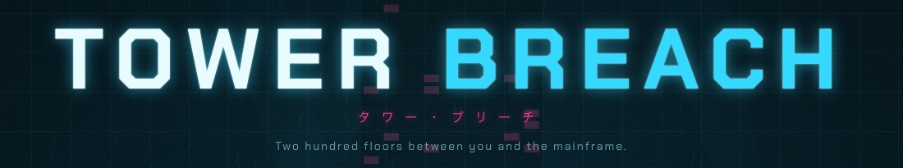
</p>

<p align="center">
  <b>Two hundred floors between you and the mainframe.</b><br>
  An isometric co-op tactical survival game for the desktop and the browser.
</p>

<p align="center">
  <a href="../../releases/latest"></a>
  
  
  
  
  <br>
  
  
  
  
  <a href="LICENSE"></a>
</p>

---

> [!WARNING]
> **Tower Breach is in BETA.** It's playable from the street to the crown, but expect bugs, balance changes and the
> odd rough edge, especially in online co-op and voice chat, which are new. Saves and settings may not carry over
> between beta versions, and co-op players and the server must all run the **same version**. Found a problem?
> Please [open an issue](../../issues) with your OS, the version shown on the main menu, and what happened.

Three years ago an AI called **SOVEREIGN** took the grid. It runs the country from the top of a 200-floor tower.
You carry **LULLABY**, a kill-switch virus on a USB drive. Fight, sneak and hack your way up, floor by floor, then
plug it into the mainframe. That starts a 60-second shutdown, and everything left in the tower comes for you.

You get one life. Each run is a new tower. You can go in alone or with up to four friends.

<p align="center">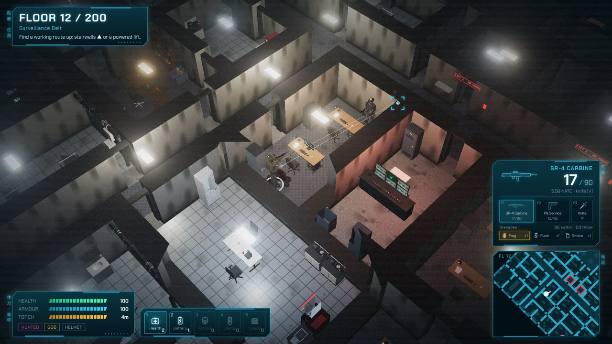</p>

## Features

- 🏢 **200 generated floors.** Each run builds a new tower of offices, boardrooms, kitchens, plant rooms and
  stairwells. The enemies, traps and darkness get worse every 10 floors.
- 🥷 **Stealth or a firefight.** Light, noise, stance and line of sight all matter. Crouch in the dark, kill the
  lights, take someone out with a backstab, or go loud.
- 🔦 **Darkness.** From floor 20 each floor gets darker. Your gun torch shows you traps, and it also shows the enemy
  where you are.
- 🤖 **Six enemy types:** loyalists, attack dogs, patrol drones, cyborgs, cyber-hounds and Warden mechs. The machines
  share an AI network and respond to each other's alarms.
- 💻 **Hacking.** Beat two puzzles before the trace finishes. Security terminals throw password cracking, byte
  decrypting, camera sequences and signal jamming at you. Lighting terminals throw wiring, breakers, circuit routing and
  voltage calibration. A security terminal kills the cameras and traps on its floor. A lighting terminal brings the
  lights back.
- 🪜 **A route up.** Stairwells can be on fire, full of debris or collapsed, and only some lifts have power. Every
  floor has at least one way up.
- 🛒 **Armory.** Spend your budget on 22 guns, armour, five grenade types and gear. After that, you only have what
  you find on the way up.
- 👥 **Co-op for up to 5.** Revive downed teammates with a Health Kit. Friendly fire is optional.
- 🎃 **Holiday themes.** Halloween and Christmas versions of the street and the tower.
- 🎛️ **Everything is generated in code.** All models, textures, animations and sound effects. The only recorded
  audio is the street ambience.

## Screenshots

<table>
  <tr>
    <td width="50%">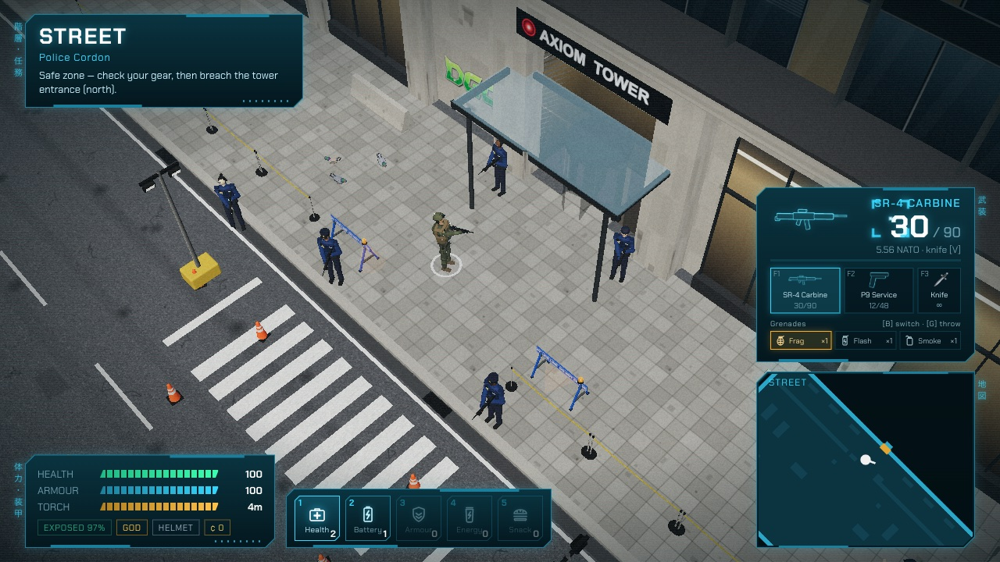<br><sub><b>The street.</b> Check in with the police chief and gear up before you go in.</sub></td>
    <td width="50%">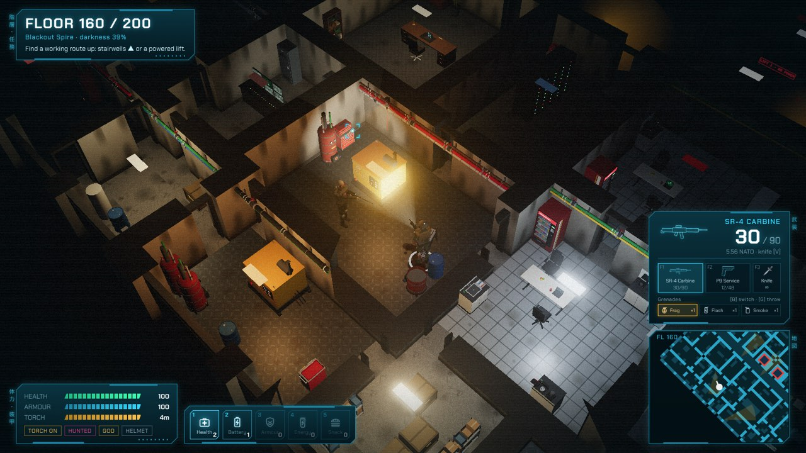<br><sub><b>Floor 160.</b> A cyborg in the torch beam. Darkness here is 39%.</sub></td>
  </tr>
  <tr>
    <td>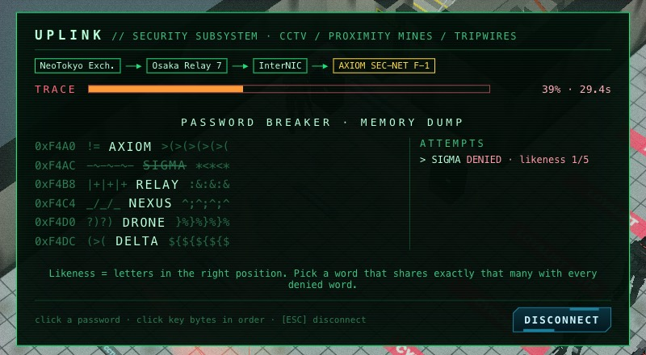<br><sub><b>Uplink.</b> Work out the password from the leaked memory dump before the trace reaches 100%.</sub></td>
    <td>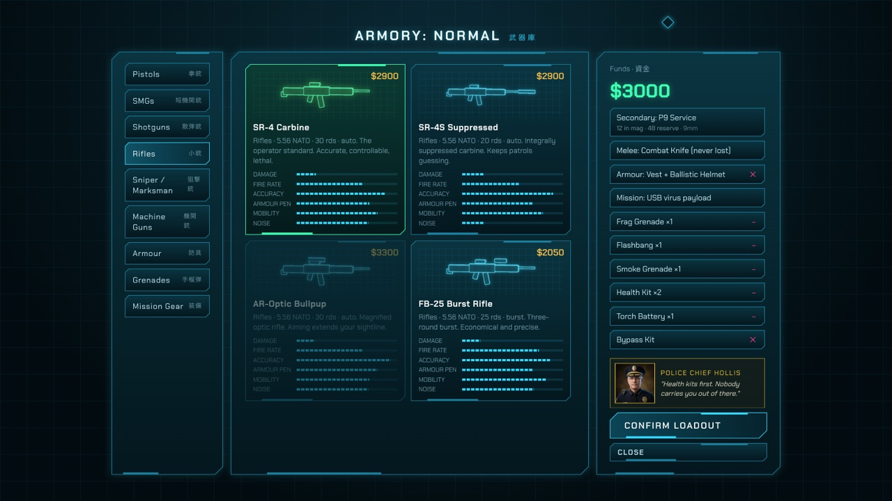<br><sub><b>The armory.</b> Your budget depends on the difficulty.</sub></td>
  </tr>
  <tr>
    <td>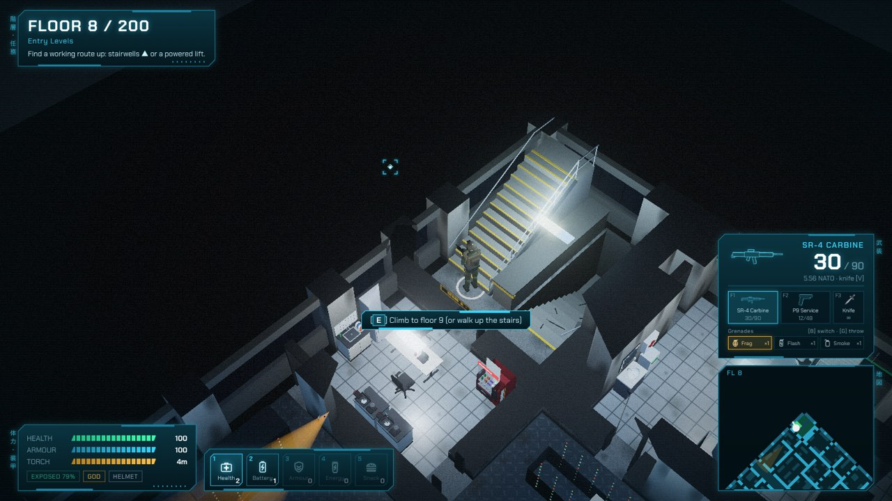<br><sub><b>Stairwells.</b> Walk up the stairs, or press E at the foot to climb.</sub></td>
    <td>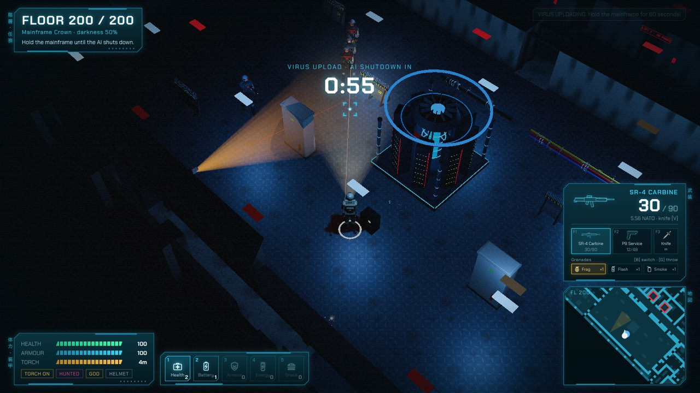<br><sub><b>Floor 200.</b> Hold the mainframe for 60 seconds while SOVEREIGN shuts down.</sub></td>
  </tr>
</table>

## Download and play

Get the latest build from **[Releases](../../releases/latest)**:

| Platform | File | First run |
|---|---|---|
| **Windows** | `Tower Breach Setup <version>.exe` (installer) or `TowerBreach-<version>-portable.exe` (no install) | The build is unsigned. If SmartScreen appears, click **More info → Run anyway**. |
| **macOS** | `TowerBreach-<version>-arm64.dmg` (Apple Silicon) or `-x64.dmg` (Intel) | Drag the app to Applications. The first time, **right-click the app → Open**. |
| **Linux** (Debian/Ubuntu) | `tower-breach_<version>_amd64.deb` | `sudo apt install ./tower-breach_*.deb` |
| **Co-op server** (optional) | `towerbreach-server-windows-x64.exe`, `-macos-arm64`, `-macos-x64` or `-linux-x64` | Only the person hosting needs it. See **[docs/HOSTING.md](docs/HOSTING.md)**. |

**Co-op with cross-play.** Someone runs the **dedicated server**: a single download for Windows, macOS or Linux
(`towerbreach-server-<os>`), or a small VPS. Friends join it from the **desktop app on any OS** (Co-op → server
address → **Join server**), or from a **browser** by opening `http://<server>:8787`. Both kinds of player can be in
the same squad. The server runs the game itself, so the run carries on when anyone leaves, and they can rejoin with
the same callsign. Late friends can still join while the squad is on the street; once someone enters the tower the
squad is locked. Squadmates on the same floor and close by can talk with **proximity voice chat** (push-to-talk,
routed through the server, no extra setup). How to run one, including port forwarding and firewalls:
**[docs/HOSTING.md](docs/HOSTING.md)**. Browser players can also still host a squad in their own browser through the
relay (`npm start`, 5-letter codes). See the [co-op notes](docs/DEVELOPMENT.md#playing-co-op-online).

📖 **New to the game? Read the [player manual](docs/MANUAL.md).**

## Controls

| Action | Keyboard and mouse | Controller |
|---|---|---|
| Move | W A S D | Left stick |
| Aim / fire | Mouse / left click | Right stick / RT |
| Aim down sights | Right click | LT |
| Sprint (loud) | Left Shift | Left stick click |
| Crouch | C | B |
| Jump / vault / clear tripwires | Space | A |
| Reload | R | X |
| Knife | V | Right stick click |
| Interact, loot, revive, use stairs and lifts | E (tap or hold) | RB |
| Throw grenade / switch grenade | G / B | LB / D-pad → |
| Torch | T | D-pad ↑ |
| Select / use belt item | 1–5 or mouse wheel / F | D-pad ← / D-pad ↓ |
| Pause | Esc | Start |

You can remap every key under **Settings → Controls**. The [manual](docs/MANUAL.md#3-controls) lists every control.

## Holiday themes

Themes switch on automatically at **Halloween**, **Christmas** and **Easter**, on the day and the 3 days before each,
using your device's date. At Halloween the tower fills with zombies, skeleton dogs, bats and ogres. At Christmas the
street is under snow, the police wear Santa suits and the loyalists are armed elves. At Easter the street turns to
chocolate, the police cars are giant baskets, the police wear bunny suits and the enemies are dentists. Each theme has
its own lift music. In the browser build, add `?holiday=halloween`, `?holiday=xmas`, `?holiday=easter` or
`?holiday=none` to the URL to choose a theme.

<table>
  <tr>
    <td width="33%">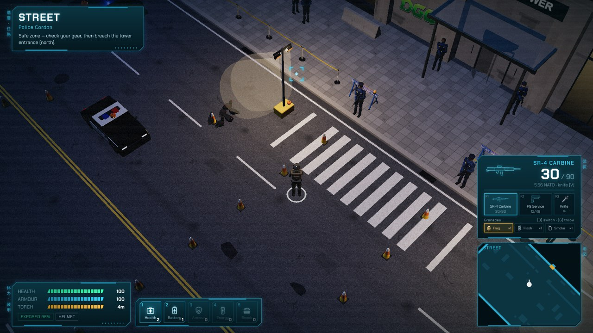<br><sub><b>Halloween</b></sub></td>
    <td width="33%">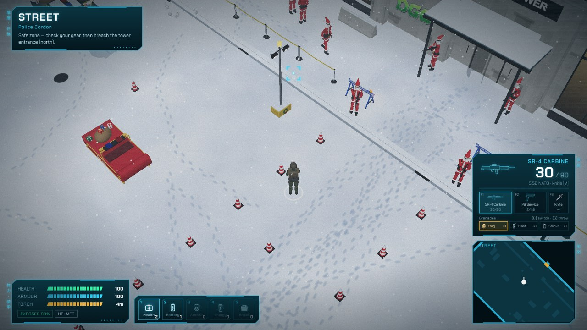<br><sub><b>Christmas</b></sub></td>
    <td width="33%">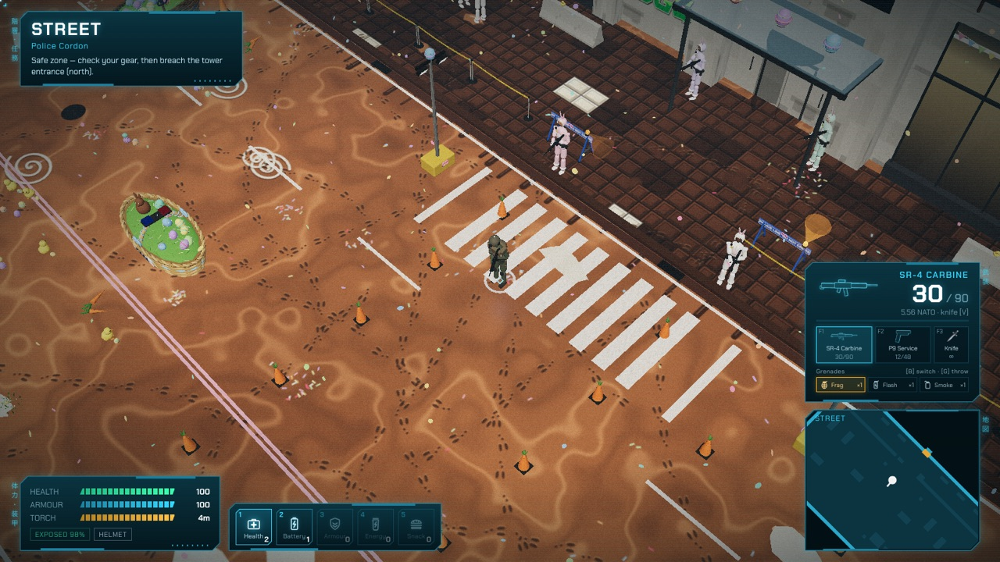<br><sub><b>Easter</b></sub></td>
  </tr>
</table>

## Build from source

You need Node.js 18 or later (22 or later to run the tests).

```bash
npm install
npm run dev          # play at http://localhost:5173
npm run build        # production build into dist/
npm start            # game + co-op relay at http://localhost:8080
npm run server       # dedicated co-op server at http://localhost:8787 (after npm run build)
npm test             # headless test suite

npm run dist:win     # Windows installer + portable exe
npm run dist:mac     # macOS dmg (x64 + arm64)
npm run dist:linux   # Debian .deb
npm run dist:server  # dedicated server binaries for Windows, macOS (x64, arm64), Linux (needs Bun)
npx install-electron && npm run desktop   # run the desktop app locally
```

`npm run online` starts a server with a public Cloudflare link you can share for co-op. Test URLs, the architecture,
the asset pipeline and modding notes are in **[docs/DEVELOPMENT.md](docs/DEVELOPMENT.md)**.

## Credits

Design and development: BoKu.

Third-party components:

- [three.js](https://threejs.org) (MIT)
- [ws](https://github.com/websockets/ws) (MIT), used by the relay and the dedicated server
- [Bun](https://bun.sh) (MIT) compiles the standalone dedicated-server binaries and is included in them
- Chakra Petch UI font (SIL Open Font License 1.1), via `@fontsource/chakra-petch`
- Street ambience: "citystreet3" by sagetyrtle (CC0 1.0). See [public/audio/CREDITS.txt](public/audio/CREDITS.txt).

## License

Tower Breach is free software, licensed under the GNU Affero General Public License v3.0. See [LICENSE](LICENSE). If
you run a modified version as a network service (for example, the web build and relay), you must offer its source to
its users.
