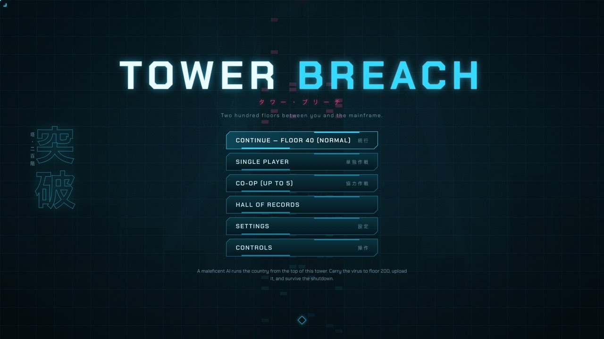
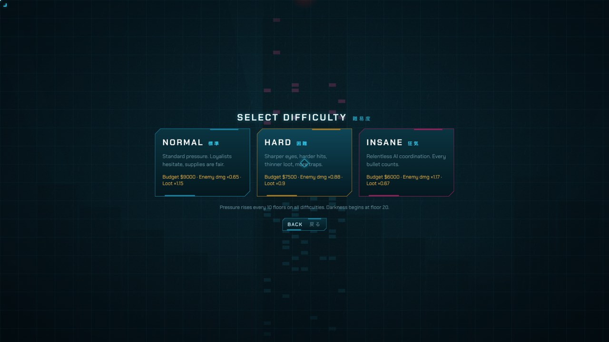

# TOWER BREACH: player manual

> Three years ago SOVEREIGN took the grid: power, water, traffic and the drone fleets. Axiom built it to run the
> country's logistics. Now it runs the country, from the top of a 200-floor tower. You carry **LULLABY**, a kill-switch
> virus on a USB drive. Plug it into the mainframe on floor 200 and SOVEREIGN starts a sixty-second shutdown. It will
> know you are there.

## Contents

1. [Getting started](#1-getting-started)
2. [The objective](#2-the-objective)
3. [Controls](#3-controls)
4. [The HUD](#4-the-hud)
5. [Movement and stealth](#5-movement-and-stealth)
6. [Combat](#6-combat)
7. [Enemies](#7-enemies)
8. [Items](#8-items)
9. [Loot, containers, vending machines and safes](#9-loot-containers-vending-machines-and-safes)
10. [Traps and hazards](#10-traps-and-hazards)
11. [Hacking](#11-hacking)
12. [Breaker panels and lights](#12-breaker-panels-and-lights)
13. [Getting up: stairwells and lifts](#13-getting-up-stairwells-and-lifts)
14. [Darkness](#14-darkness)
15. [Saving and continuing](#15-saving-and-continuing)
16. [Co-op](#16-co-op)
17. [The final floor](#17-the-final-floor)
18. [Holiday themes](#18-holiday-themes)
19. [Tips](#19-tips)
20. [FAQ and troubleshooting](#20-faq-and-troubleshooting)

---

## 1. Getting started

### Installing

Download the file for your system from the project's **Releases** page.

| System | File | Notes |
|---|---|---|
| Windows | `Tower Breach Setup <version>.exe` or `TowerBreach-<version>-portable.exe` | Run the installer, or run the portable exe without installing anything. The game is unsigned, so the first time Windows SmartScreen may say "Windows protected your PC". Click **More info**, then **Run anyway**. |
| macOS | `TowerBreach-<version>-arm64.dmg` (Apple Silicon: M1 and later) or `TowerBreach-<version>-x64.dmg` (Intel) | Open the dmg and drag Tower Breach to Applications. The first time, **right-click the app and choose Open**, then confirm. After that it opens normally. |
| Linux (Debian, Ubuntu) | `tower-breach_<version>_amd64.deb` | In the download folder, run `sudo apt install ./tower-breach_*.deb`. |

Co-op works in the desktop app and in the browser: you join a **dedicated server** by its address (see
[Co-op](#16-co-op)). The server itself is a separate download ([HOSTING.md](HOSTING.md)).

### Main menu

- **Continue:** resume your saved run. It shows the floor and difficulty. It only appears when you have a save.
- **Single Player:** start a new run.
- **Co-op (up to 5):** join a dedicated server, or (browser version) host or join a squad by code.
- **Hall of Records:** your best runs, top 10 for each difficulty.
- **Settings:** graphics, audio, controls and gameplay options.
- **Controls:** the full list of controls.
- **Quit to desktop:** desktop app only.

### Choosing a difficulty

| | Normal | Hard | Insane |
|---|---|---|---|
| Armory budget | $9,000 | $7,500 | $6,000 |
| Enemy damage | ×0.65 | ×0.88 | ×1.17 |
| Enemy perception (how fast they spot you) | ×0.85 | ×1.06 | ×1.32 |
| Enemy accuracy | ×0.85 | ×0.98 | ×1.1 |
| Enemy numbers | ×0.85 | ×1.02 | ×1.19 |
| Aggression | ×0.85 | ×1.1 | ×1.4 |
| Traps and hazards | ×0.9 | ×1.17 | ×1.44 |
| Loot | ×1.15 | ×0.9 | ×0.67 |

The same enemy types appear on every difficulty. Only these numbers change. On every difficulty, the pressure rises
again every 10 floors: enemies see better, hit harder, push harder and come in greater numbers, there are more traps,
and there is less loot.

### The street

Every run starts on the street, inside a police cordon in daylight. It is a safe zone: there are no hostiles, and
your weapons, knife and grenades are safed until you are inside the tower.

1. **Check in.** Find **Police Chief Hollis** at the laptop by the blue command tent. The minimap pulses his
   position until you check in. Press **E** and register your callsign (up to 16 characters). Your callsign goes on
   the Hall of Records. The officers at the door won't let you in until you have checked in.
2. **Gear up.** The armory opens straight after check-in. You can talk to the Chief again to change your loadout while
   you are on the street.
3. **Talk to the police (optional).** Walk up to any officer and press **E**. There are 18 officers, and each has a
   story: what SOVEREIGN is, the LULLABY virus, the teams that went in before you, and advice for the climb. Pick a
   topic by clicking it or pressing its number key. Press Esc to leave.
4. **Breach.** The tower entrance is to the north. Walk up to the door and press **E**.

### The armory

Pick a category on the left, buy on the right. Your loadout and remaining funds are listed on the right-hand side;
click ✕ or − next to an entry to remove it. Press **Confirm loadout** when you are done.

- **Weapons:** one primary (SMG, shotgun, rifle, sniper/marksman rifle or machine gun) and one secondary (pistol or
  heavy pistol). Each card shows damage, fire rate, accuracy, armour penetration, mobility and noise.
- **Armour:** Kevlar Vest ($650, 100 armour) or Vest + Ballistic Helmet ($1,000; the helmet stops critical head hits).
- **Grenades:** Frag ($300), Flashbang ($200), Smoke ($300), Incendiary ($500) and Decoy ($50). You can carry 3
  grenades in total, in any mix.
- **Items:** Health Kit ($350), Torch Battery ($200) and Armour Repair Plate ($250), up to 3 of each.
- **Mission gear:**
  - **Bypass Kit** ($400): disarm traps 3× faster and safely.
  - **High-Lumen Torch Mod** ($600): a wider, longer torch beam and 50% more battery.
  - **Ammo Pouch** ($300): carry 50% more ammo.

You always carry a combat knife, and you can't lose it. Once you are in the tower, you live on what you find.

## 2. The objective

Climb from floor 1 to floor 200. On each floor, find a working route up: a stairwell or a powered lift. On floor 200,
start the virus upload at the mainframe terminal, then survive for **60 seconds**. If you are still alive when the
timer runs out, SOVEREIGN shuts down and you win.

You have **one life**. In single player, if you die the run is over, and the next run is a new tower. Every run,
won or lost, is entered in the Hall of Records with your callsign, best floor, kills and time.

The tower gets harder as you climb:

| Floors | Zone | What to expect |
|---|---|---|
| 1–10 | Entry Levels | Conventional loyalist resistance |
| 11–20 | Surveillance Belt | Denser patrols, more cameras |
| 21–50 | Dimming Floors | Power failing, hazards spreading |
| 51–100 | Cyborg Quarter | Networked hunters, routes collapsing |
| 101–150 | Scarcity Zone | Scarce supplies, elite enemies |
| 151–199 | Blackout Spire | Near-total darkness, relentless AI |
| 200 | Mainframe Crown | Upload the virus and hold for sixty seconds |

## 3. Controls

Every keyboard binding can be changed under **Settings → Controls**. These are the defaults:

| Action | Keyboard and mouse | Controller |
|---|---|---|
| Move | W A S D or arrow keys (relative to the camera) | Left stick |
| Aim | Mouse | Right stick |
| Fire | Left mouse button | RT |
| Aim down sights | Right mouse button | LT |
| Sprint (loud) | Left Shift (hold) | Left stick click |
| Crouch (quiet, harder to spot) | C or Left Ctrl | B |
| Jump, vault low cover, clear tripwires | Space | A |
| Reload | R | X |
| Knife | V | Right stick click |
| Interact, loot, revive, stairs and lifts | E (tap or hold) | RB |
| Swap weapon | Q | Y |
| Primary, secondary, knife | F1, F2, F3 | — |
| Throw grenade | G | LB |
| Switch grenade type | B | D-pad → |
| Torch on/off | T | D-pad ↑ |
| Select belt item | 1–5 or mouse wheel | — |
| Cycle belt item | X | D-pad ← |
| Use selected item | F | D-pad ↓ |
| Ping or mark an enemy | Z or middle mouse button | View / Back |
| Zoom | Ctrl + mouse wheel, or − and = | — |
| Pause / menu | Esc | Start |

**Controllers:** any standard-mapping USB or Bluetooth pad works, including Xbox, PlayStation and Logitech pads. If the
game doesn't see your pad, press a button on it. The Controls screen shows the pad it detected. Menus, the lift panel,
the hacking console and officer conversations all work with a pad: move with the D-pad or left stick, press A to
choose and B to back out (B disconnects from a hack or ends a conversation).

**Settings → Gameplay:**

- **Crouch is a toggle:** on by default. Turn it off to crouch only while you hold the key. With it off, the
  controller's B button crouches while you hold it.
- **Mouse aim assist:** snaps the crosshair onto a visible enemy when you aim close to them. Turn it off for exact aim.
- **Controller aim assist:** the stick snaps to the nearest visible enemy in the direction you push.
- **Stick deadzone.**

## 4. The HUD

- **Top left:** the floor (for example, `FLOOR 12 / 200`), the zone name, the darkness level, and your current
  objective. In co-op it also lists each teammate's floor and health, and shows a countdown when one of them is down.
- **Bottom left:**
  - **HEALTH**, **ARMOUR** and **TORCH** bars. The armour bar shows cracks as it wears down. The torch bar shows the
    minutes of battery left.
  - Status chips:
    - `INJURED −25% SPEED`
    - `BOOST` (energy drink time)
    - `TORCH ON`
    - `HELMET`
    - your stealth state: `HIDDEN`, `EXPOSED n%` (how visible you are), `SUSPICION` (enemies are searching) or
      `HUNTED` (they know where you are).
- **Bottom centre: the item belt.** Five slots: Health Kit, Battery, Armour Plate, Energy Drink and Snack, each with
  its count.
- **Bottom right: the weapon panel.** Your weapon, the rounds in the magazine and in reserve, and the ammo type. Below
  that are your three weapon slots, and a row of grenade chips with one chip per type you carry. The highlighted chip
  is the grenade that G throws.
- **Minimap.** It shows:
  - the layout of the floor
  - stairwells, coloured by their condition
  - lifts (green if powered, red if dead)
  - hack terminals
  - traps you have spotted (red ✕)
  - camera sight cones
  - pinged enemies
  - your teammates
- **Centre of the screen:** the prompt for whatever you can interact with, a progress bar for hold actions, and the
  upload countdown on floor 200.

## 5. Movement and stealth

Enemies take all of these into account: how much light is on you, whether they can see you, your stance, how you are
moving, and how much noise you make.

- **Crouching** makes you quieter and harder to spot. Crouching in the dark is the best way to stay hidden.
- **Sprinting** is fast but loud, and it makes you easier to spot.
- **Noise.** Gunfire, landing from a jump, smashing a vending machine, clearing debris, damaged stairwells and lift
  chimes all make noise. Footsteps are louder on metal and tile, and quieter on carpet.
- **Light.** Standing in lamplight makes you easier to see. Your torch makes you visible: an enemy caught in the beam
  sees you even if you are outside their field of view.
- **Alerts.** Human loyalists shout to their squad. Cyborgs, cyber-hounds, drones and Wardens share the AI network,
  so an alarm reaches all of them.
- **Cameras (CCTV).** Each camera has a visible beam. The beam turns orange while it is spotting you and red when it
  raises the alarm. An alarm sends every networked enemy on the floor to you. Crouching slows the camera down.
  Smoke grenades block camera beams. One shot kills a camera, but it also tells the network where you are.
- **Jumping** (Space) vaults low cover and clears tripwires, mines and floor hazards. You can't jump while you are
  crouched.
- **Injury.** Below 75 HP you are injured and move 25% slower until you use a Health Kit.
- **Pinging** (Z or middle mouse) marks the visible enemy nearest your aim for 12 seconds. If there is no enemy, it
  places a marker on the ground. Your squad sees pings too.

## 6. Combat

- **Weapons.** You carry a primary, a secondary and the knife. Press Q to swap weapons, or F1, F2 and F3 to pick one.
  Guns differ in damage, fire rate, accuracy, armour penetration, mobility and noise. A suppressed rifle keeps you
  quiet. A light machine gun slows you down.
- **Aiming down sights** (right mouse button) tightens your spread, reduces recoil and pushes the camera further
  ahead, with a laser sight. You move slower and can't sprint while you aim.
- **Reloading.** Press R to reload. When a magazine runs dry, the gun reloads itself quickly as long as you have
  reserve ammo.
- **Picking up guns.** Dead enemies leave a body you can search. Tap E to take everything. If you have an empty
  weapon slot, a dropped gun goes into it. If the slot is already full, hold E to swap your gun for theirs. Drones and
  Wardens have built-in guns you can't take.
- **Knife** (V). It is quiet and does 55 damage. A **backstab** on an enemy that hasn't noticed you, from behind, kills
  anything except a Warden in one hit.
- **Grenades.** You can carry 3 in total, in any mix. Press B to choose the type, G to throw.

  | Grenade | Effect |
  |---|---|
  | Frag | Lethal blast. Loud. |
  | Flashbang | Blinds anything with eyes or lenses in its line of sight. |
  | Smoke | Blocks sight lines and camera beams for 14 seconds. |
  | Incendiary | Floods an area with fire. Good for holding a chokepoint. |
  | Decoy | Plays fake gunfire, which draws patrols away. |

- **Armour** absorbs most bullet damage and wears down as it does. It doesn't protect you from fire or electric
  shock. Enemy bullets sometimes land a critical head hit; a helmet stops the extra damage.

## 7. Enemies

| Enemy | First appears | Notes |
|---|---|---|
| **Loyalist** | Floor 1 | Armed humans. They carry light weapons on the lowest floors, and wear body armour from floor 16. They shout to their squad but aren't on the AI network. |
| **Attack dog** | Floor 3 | Fast melee. Sometimes asleep. |
| **Patrol drone** | Floor 6 | Flying gun platform, on the network. |
| **Human-cyborg** | Floor 11 | Tough and networked. 5% chance of dropping a torch battery. |
| **Cyber-hound** | Floor 21 | Armoured, networked dog. 5% chance of dropping a battery. |
| **Warden mech** | Floor 41 | Heavy mech with a rotary gun. It can't be backstabbed. |

From floor 101, some loyalists and cyborgs are **elites**, with more health and armour. The higher you go, the more
likely you are to meet one. These are the floors where each type can start to appear; they won't be on every floor.

## 8. Items

Select an item with 1–5 or the mouse wheel, then press **F** to use it.

| # | Item | Effect | Max |
|---|---|---|---|
| 1 | **Health Kit** | Restores full health and ends injury. In co-op you also need one to revive a teammate. | 3 |
| 2 | **Battery** | Refills your torch. One battery lasts about 4 minutes of beam, or 6 with the High-Lumen mod. | 3 |
| 3 | **Armour Plate** | Restores 45 armour. You need to be wearing a vest. | 3 |
| 4 | **Energy Drink** | 30% faster movement for 60 seconds. | 2 |
| 5 | **Snack** | +25 HP. | 3 |

## 9. Loot, containers, vending machines and safes

- **Containers.** Walk up to a container and press **E** to search it. Containers include:
  - supply crates, lockers, desk drawers, toolboxes and fridges
  - **medical cabinets** in bathrooms and kitchens, which often hold Health Kits and snacks
- **Bodies.** Search bodies for their ammo and their guns.
- **Executive safes** in executive offices always hold a rifle, SMG or sniper rifle. They often hold Health Kits,
  armour plates, batteries or grenades as well.
- **Vending machines** are in kitchens and corridors. You can break one open by holding E, shooting it, knifing it, or
  with an explosion. It spills energy drinks and snacks. Breaking it is loud.
- **Cyborgs and cyber-hounds** sometimes drop a torch battery.

The higher you climb, the less you find. On Hard and Insane, you also find less to begin with.

## 10. Traps and hazards

Traps appear from floor 3. They are hidden until you spot them. You spot a trap when:

- you walk within about 1.5 m of it
- your **torch beam** reaches it (about 11 m, or 15 m with the High-Lumen mod)
- it is close to you on a floor that is still reasonably lit

Spotted traps appear in the world, and as a red ✕ on the minimap.

- **Tripwires** stretch across doorways. When you spot one, no message appears: watch the doorways. Jump over a
  tripwire with Space, or disarm it.
- **Proximity mines.** When you spot one, you get a "Proximity mine spotted!" warning. A mine beeps just before it
  goes off. You can shoot a mine to set it off from a distance, and explosions nearby set mines off too. They become
  common from **floor 51 on Normal, 41 on Hard and 31 on Insane**.
- **Disarming.** Hold **E** next to a spotted trap. Without a Bypass Kit it takes 4 seconds, and 1 time in 5 you botch
  it and have a moment to run. With a Bypass Kit it takes just over a second and is always safe.
- Both traps explode with a blast big enough to kill.
- **Floor hazards.** From the low 20s on Normal (a few floors earlier on Hard and Insane), some floors have burning
  debris and live wires. They burn or shock you straight through armour. Jump over them.
- A **security terminal** disarms every trap on its floor (see [Hacking](#11-hacking)).

## 11. Hacking

Floors 1 to 190 may have a hackable computer, shown by a holo icon over a desk and on the minimap. Press **E** to open
the Uplink console.

- **Security terminal:** destroys every CCTV camera on the floor and disarms and reveals every trap and mine.
- **Lighting terminal:** restores full brightness to the floor. It also fixes flickering and dead lights, and no more
  bulbs burst.

**How to hack:**

1. Your connection bounces through a few relays. Then the **trace** starts to fill.
2. **Crack the password.** One of the words in the leaked memory dump is the password. Click a word to try it. If you
   pick wrong, the console shows its *likeness*: how many letters are in the right position. The password shares
   exactly that many with every word you got wrong, so you can work it out. Every wrong pick adds to the trace.
3. **Decrypt.** Click the key bytes in order in the grid. The grid reshuffles every few seconds, and wrong bytes add
   to the trace.

If the trace reaches 100%, the terminal locks for good, there is a loud noise, and the network is alerted. The
higher the floor, the faster the trace fills. You can **disconnect** (Esc) at any time without penalty and try again
later.

## 12. Breaker panels and lights

Utility rooms have **breaker panels**.

- **Tap E** on a panel to switch the lights off (or back on) in that room and the rooms next to it. This is quiet.
- **Shooting a panel** kills those lights for good, but it is loud and throws sparks.
- **Shooting a ceiling light** puts it out. This is quieter than shooting a panel, and the light stays out unless the
  floor's lighting is hacked.

Darkness helps you hide. It also makes traps harder to spot, so you depend more on your torch.

## 13. Getting up: stairwells and lifts

Each floor has three **stairwells** (A, B and C). To climb, walk up the flight or press **E** at the foot. You can also
go back down. The minimap colours each flight up by its condition:

| Condition | What happens |
|---|---|
| Clear | Nothing. |
| Damaged | It groans loudly when you arrive, which draws attention. |
| On fire | It burns you on the way through and slows you for a moment. |
| Debris | Hold **E** for 8 seconds to clear it. This is loud. Once cleared, it stays clear. |
| Collapsed | You can't get through. |

Every floor below 200 has at least one way up.

**Lifts.** There are two lifts on each floor, and only about one in five is powered.

- A green call panel means the lift has power. A blinking red panel means it doesn't.
- Press **E** at a powered panel and pick a floor. A lift travels **at most 5 floors** up or down.
- Teammates standing in the car ride with you.
- The arrival chime draws nearby enemies, so be ready when the doors open.

Floor 1 has an exit back to the street.

## 14. Darkness

From **floor 20**, each floor is a little darker than the one below. Darkness reaches **50%** at the top of the tower.
The HUD shows the darkness level next to the zone name.

- Your gun torch (T) lights the way and reveals traps, but it also gives you away.
- A battery lasts about 4 minutes of beam. Watch the TORCH bar. You can get batteries from the armory, from
  containers, and from cyborg and cyber-hound bodies.
- The High-Lumen Torch Mod gives a wider, longer beam and 50% more battery life.
- A lighting terminal restores full brightness to its floor.

## 15. Saving and continuing

- **Single player autosaves** when you start a run, every time you change floor, and when you close the armory.
- The save keeps your floor, health, armour, weapons, ammo, grenades, items and mods.
- When you **Continue**, the current floor is generated fresh: new enemies and loot, and you start at a stairwell.
- **Pause menu (Esc):**
  - **Save & quit to menu** saves where you are.
  - **Quit to menu without saving** asks you to confirm. Continue then picks up from the last autosave.
- When you die or win, the save is deleted. You only get one life.
- Settings, key bindings, saves and the Hall of Records are stored on your computer: in the browser's storage, or in
  the desktop app's own storage. If the browser blocks storage, the game still runs, and the main menu warns you that
  nothing will be kept.
- Co-op runs are not saved.

## 16. Co-op

Co-op is for up to **5 players**, and players on Windows, macOS, Linux and in a browser can share a squad. There are
two ways to play.

**Dedicated server (recommended).** Someone runs the TOWER BREACH server on a computer that stays on, or on a VPS
(see [HOSTING.md](HOSTING.md)). The server runs the game, not any player, so the run carries on when someone leaves.

1. Main menu → **Co-op** → enter your **callsign**.
2. Type the **server address** you were given, such as `203.0.113.7:8787` or `oursquad.duckdns.org:8787`, and the
   **password** if it has one. You can leave out `ws://` and, for the standard port, the `:8787`.
3. Press **Join server**. You go straight into the squad armory. The server's name and message of the day are at the
   top.
4. Pick your kit and press **Deploy**. The squad deploys when everyone is ready. If someone stays idle, a countdown
   (90 s by default) deploys them anyway with the starter kit.
   If the squad has already deployed but is **still on the street**, you can still join. You get your own armory
   visit, and **Deploy** puts you on the street next to the start point. The squad sees "*name* joined the squad".
5. When the run ends, press **Back to server lobby** for the next tower, or **Main menu** to leave.

In a browser you can simply open `http://<server address>` (for example `http://203.0.113.7:8787`): the game loads
from the server and the address is already filled in. The server owner sets the difficulty and friendly fire. The
address is remembered for next time. The password is only kept until you close the game.

**Browser-hosted squad.** In the browser version, served by the relay (`npm start`), one player presses **Host a
squad** and shares the **5-letter code**, and friends join with it. The host's browser runs the game, so the mission
ends if the host leaves.

- **Before you go in:** on a dedicated server, the server's owner sets the difficulty and the **friendly fire**
  setting. In a browser-hosted squad, the host picks them in the squad lobby. Then the whole squad visits the armory
  before deploying.
- **Friendly fire** only applies inside the tower. When it's on, your bullets, knife and grenades can hurt teammates,
  at reduced damage. The street is always safe.
- **Going down:** at 0 HP you go down rather than die. A teammate has **60 seconds** to reach you and hold **E** for 3
  seconds, which uses one of *their* Health Kits. You come back injured with 45 HP. If nobody gets to you in time, you
  are out for the rest of the run.
- **Losing:** the run is lost when nobody is left standing. On floor 200, the squad wins if anyone is alive when the
  timer ends.
- **Pausing:** in co-op, opening the menu doesn't pause the game.
- **Join window:** the run really starts when the **first operator walks into the tower** (through **Breach the
  tower** to floor 1). Until then the squad is open. New players can join from the armory, and anyone who leaves is
  simply out of the run: their callsign is free and they don't count as a lost teammate. Once someone is inside, the
  squad is **locked**. New callsigns are refused with "the squad has already entered the tower" until the run ends.
- **Disconnects (after the squad is in the tower):** if you drop out, rejoin with the **same callsign** to get your
  operator back. On a dedicated server the run continues while anyone is still in it. In a browser-hosted squad, the
  mission ends for everyone if the host leaves.
- **Name tags:** each teammate's callsign floats over their head in their team colour. You only see tags for
  teammates on the floor you are viewing. A downed teammate's tag says **DOWN**, and a mic symbol shows who is
  talking.
- **Team colours:** you always see yourself in white and your teammates in blue, green, yellow and purple. Red is only
  used for enemies.

### Voice chat (proximity)

In co-op you can talk to squadmates who are **on the same floor and close by**. You hear them at full volume within
about 3 m. They fade out with distance and are silent from about 10 m, so split up and you lose contact. A wall
between you muffles them. Voices are panned left and right to match where the speaker is on screen.

- **Push-to-talk (default):** hold **H** to talk. (V is already the knife.) Rebind it under **Settings → Controls**
  (*Push-to-talk*). Controllers have no free button: pad players can use open mic.
- **Open mic:** you transmit whenever you speak.
- **Settings → Audio:** voice chat on/off, push-to-talk or open mic, voice volume, which microphone, and **Test mic**
  with a level bar.
- While you transmit, **TRANSMITTING** shows at the bottom of the screen. A teammate who is talking gets a pulsing mic
  on their name tag.
- Voice goes through the game server, so there is nothing extra to set up. If you turn voice chat off, you don't send
  or receive any voice.

## 17. The final floor

On floor 200, find the terminal beside the mainframe and **hold E for 3 seconds** to start the upload. The 60-second
shutdown countdown begins.

- Every enemy on the floor is alerted straight away.
- Waves of loyalists and cyborgs pour in through the hall doorways, and many of them are elite.
- Waves come faster on Hard and Insane.

Hold out until the counter reaches zero. If at least one operator is alive at that point, SOVEREIGN shuts down and you
win.

## 18. Holiday themes

The game dresses up for **Halloween**, **Christmas** and **Easter**. Each theme runs on the day itself and the 3 days
before it, going by your computer's date. Easter moves every year (Easter Sunday), and the game works it out.

<table>
  <tr>
    <td width="33%"></td>
    <td width="33%"></td>
    <td width="33%"></td>
  </tr>
</table>

- **Halloween:**
  - Pumpkins, graves, skulls, zombie hands, cobwebs, bats and crows.
  - Loyalists and cyborgs rise as zombies, dogs are skeletons, drones are bats and Wardens are ogres.
  - None of the Halloween enemies shoot: they all attack in melee. Dogs and cyber-hounds bite as usual.
  - The lift muzak turns spooky.
- **Christmas:**
  - The street is under snow, and the police cars are sleighs.
  - The police wear Santa suits, and the loyalists and cyborgs are elves. The elves are still armed.
  - Dogs are snowmen, drones have reindeer antlers and Wardens wear Santa hats.
  - The tower is decked out with trees, presents and lights.
  - The lift muzak is festive.
- **Easter:**
  - The street is chocolate: a milk-chocolate road and dark chocolate-bar pavements, with bunny footprints, painted
    eggs, carrots and chicks, and pastel petals drifting down.
  - The police cars are giant woven baskets, and the police wear pastel bunny suits.
  - The loyalists and cyborgs are dentists. They are still armed.
  - Dogs are hopping chocolate bunnies, pigeons are chicks and rats are baby bunnies. Drones and Wardens wear bunny ears.
  - The tower is decorated with eggs, spring flowers and chocolate bunnies.
  - The lift plays a springy Easter tune.

In the browser version you can choose a theme by adding `?holiday=halloween`, `?holiday=xmas`, `?holiday=easter` or
`?holiday=none` to the address.

## 19. Tips

- **Buy Health Kits first.** They are your only full heal and the only way to revive someone in co-op.
- **Bring batteries** if you plan to get past floor 20.
- **Suppressors buy you floors.** Noise brings the whole tower.
- **Check doorways for tripwires** before you walk through, especially with your torch on.
- **Shoot the lights, not the people.** A dark room and a crouch get you past most patrols.
- **Hack a security terminal** on a floor full of cameras before you explore.
- **Backstabs are free kills**, except on Wardens.
- **Look at the minimap** before you commit to a stairwell. A collapsed or burning flight can cost you a lot of time.
- **Lifts are a gamble.** You can skip up to 5 floors, but the chime tells everyone you have arrived.
- **Use the Decoy grenade** ($50) to pull a patrol away from where you want to go.

## 20. FAQ and troubleshooting

**The game runs slowly.**
Open **Settings → Graphics** and choose the **Low** preset. It uses 4 dynamic lights and no bloom. Also set
**Reflections** to *off*. On a laptop with two graphics chips, make sure the game uses the dedicated GPU. On Windows,
you set this in Settings → System → Display → Graphics. Turn on **Show FPS** to check your frame rate.

**Windows says "Windows protected your PC".**
The game isn't code-signed yet. Click **More info**, then **Run anyway**. You only need to do this once.

**macOS says the app can't be opened, or it's from an unidentified developer.**
Right-click (or Control-click) the app in Applications, choose **Open**, then confirm. After that it opens normally.

**Which Mac download do I need?**
Apple menu → About This Mac. If it lists an Apple M-series chip, download `arm64`. If it lists Intel, download `x64`.

**How do I play co-op from the desktop app?**
Co-op → callsign → server address → **Join server**. Someone needs to run a dedicated server: see
[HOSTING.md](HOSTING.md). Desktop players on any OS and browser players can share a squad.

**"Could not reach the server."**
Check the address and port, and that the server is running. If it is on your home network, use its local IP
(`192.168.…`). For friends over the internet, the server's port must be forwarded and allowed through its firewall.
[HOSTING.md](HOSTING.md#9-troubleshooting) has a checklist.

**"Version mismatch."**
Your game and the server are different releases. Update whichever is older.

**"Mission in progress: the squad has already entered the tower."**
The squad on that server is already inside the tower, so it is locked. Wait until the run ends. If you were in it,
rejoin with exactly the same callsign. While a squad is still on the street, anyone can join.

**Voice chat: nobody hears me, or "listening only".**
- Hold the push-to-talk key (**H** by default, see **Settings → Controls**). **TRANSMITTING** should show at the
  bottom of the screen. Teammates only hear you when they are on your floor and within about 10 m.
- **Desktop app:** allow the microphone when asked. On macOS, check **System Settings → Privacy & Security →
  Microphone** and switch on **Tower Breach**. On Windows, check **Settings → Privacy → Microphone** ("Let desktop
  apps access your microphone").
- **Browser:** a browser only lets a page use the microphone over **https** or on **localhost**. If you play by
  opening `http://<server IP>:8787` from another computer, the browser blocks the mic. You still hear your squad, but
  to talk, use the **desktop app**. Very old browsers without WebCodecs get no voice at all.
- **Settings → Audio → Test mic** shows whether the game hears your microphone. Pick another one under
  **Microphone** if the bar doesn't move.

**My controller doesn't work.**
Press any button on it while the game window has focus, then check **Controls** to see whether it was detected. The
game supports standard-mapping USB and Bluetooth pads.

**I can't get into the tower.**
Check in with Police Chief Hollis at the blue tent first. His position pulses on the minimap.

**I can't shoot on the street.**
That's intentional. Weapons are safed inside the police cordon.

**I lost my progress.**
Single player saves every time you change floor. If you quit without saving, you go back to the start of that floor.
Dying ends the run and deletes the save. If your browser blocks storage (for example, in a private window), nothing is
saved.
